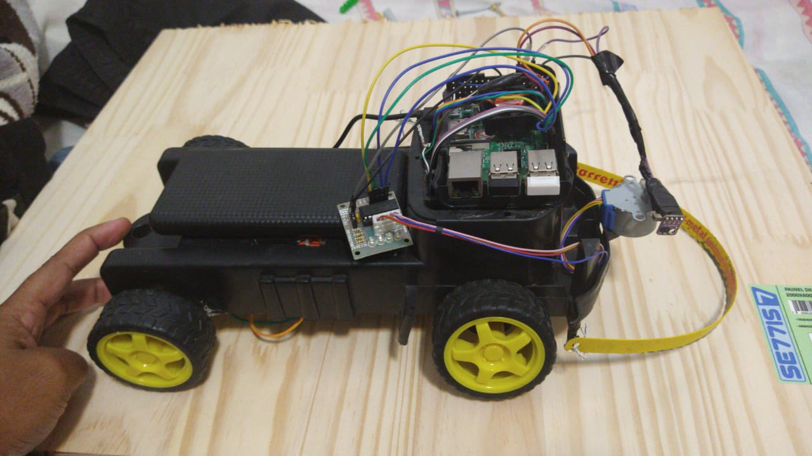
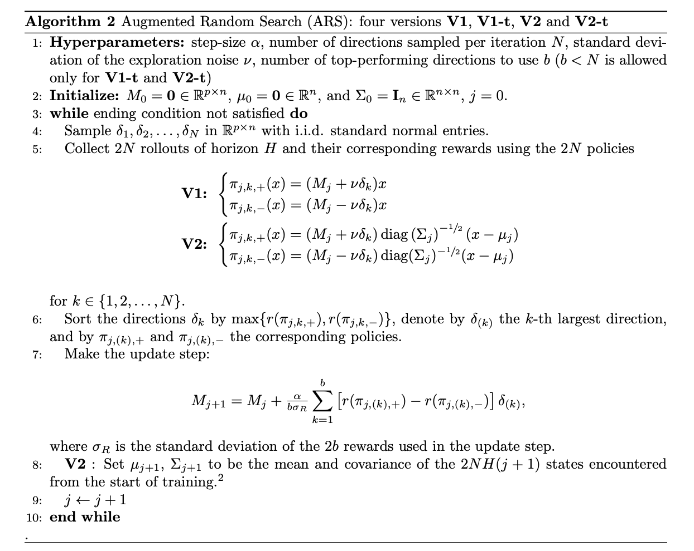

  

# TCC-IACar

  
  
  

Este repositório será utilizado pra o TCC da Faculdade Facens

  

**Aluno:** Vanderson Ferreira de Sousa

  

**RA:** 183140

  

## Introdução

Recentemente, foi descoberto um tipo muito novo de IA que você pode construir a partir zero e sem a necessidade de qualquer biblioteca de Machine Learning ou DeepLearning. Esta IA revolucionária é chamada ***Augmented Random Search(ARS)***.

Em uma implementação muito simples, é capaz de fazer exatamente o mesmo coisa que o Google Deep Mind fez em sua realização no ano passado que é treinar uma IA para andar e correr em um campo.

No entanto, o ARS é 100 vezes mais rápido e 100 vezes mais poderosos além de não haver necessidade de algoritmos e estruturas sofisticadas

  

Todos os processos e uso dessa ARS foram retiradas do Paper ***Simple random search provides a competitive approach to reinforcement learning*** no qual pode ser acessado por esse [link](https://arxiv.org/abs/1803.07055) e o paper em PDF pode ser baixado nesse [link](https://arxiv.org/pdf/1803.07055.pdf)

A ARS foi desenvolvido por Horia Mania, Aurelia Guy e Benjamin Recht do ***Department of Electrical Engineering and Computer Science
University of California, Berkeley*** em 2018 e a intenção desse repositório é demostrar o uso desse algoritmo em um carro real construido por mim utilizando um Raspiberry Pi3 + hardware necessário para mover as rodas e 1 sensor de distancia que fará leituras do ambiente e servirá de input para o algoritmo do ARS.

  

Versão 1.0 do Carro

  

Esse algoritmo está dentro da área de **Aprendizagem por Reforço**, que é um tipo de aprendizagem usado em sistemas multi-agente no qual os agentes devem interagir no ambiente e aprenderem por conta própria, ganhando recompensas positivas quando executam ações corretas e recompensas negativas quando executam ações que não levem para o objetivo. A inteligência artificial aprende sem nenhum conhecimento prévio, adaptando-se ao ambiente e encontrando as soluções

  

### Basic Random Search (BRS)

O ARS é uma inovação do código BRS tendo sua ideia na Pesquisa Aleatória Básica que é escolher uma política parametrizada 𝜋𝜃, chocar (ou perturbar) os parâmetros 𝜃 aplicando + 𝛎𝜹 e -𝛎𝜹 (onde 𝛎 <1 é um ruído constante e 𝜹 é um número aleatório gerado a partir de uma distribuição normal) .
Em seguida, aplica-se as ações baseadas em 𝜋 (𝜃 + 𝛎𝜹) e 𝜋 (𝜃-𝛎𝜹) e são as recompensas r (𝜃 + 𝛎𝜹) e r (𝜃-𝛎𝜹) resultantes dessas ações.
Agora que temos as recompensas do 𝜃 perturbado, calcula-se a média Δ = 1 / N * Σ [r (𝜃 + 𝛎𝜹) - r (𝜃-𝛎𝜹)] 𝜹 para todos os 𝜹 e atualizamos os parâmetros 𝜃 usando Δ e uma taxa de aprendizagem 𝝰.

𝜃ʲ⁺¹ = 𝜃ʲ + 𝝰.Δ

  

### Augmented Random Search (ARS)

O ARS é uma versão aprimorada do BRS e contém três eixos de aprimoramentos que o tornam mais eficiente.

#### Dividindo pelo Desvio Padrão 𝞼ᵣ

Conforme as iterações continuam, a diferença entre r (𝜃 + 𝛎𝜹) e r (𝜃-𝛎𝜹) pode variar significativamente, com a taxa de aprendizagem 𝝰 fixa, a atualização 𝜃ʲ⁺¹ = 𝜃ʲ + 𝝰.Δ pode oscilar consideravelmente. Por exemplo, se 𝝰 = 0,01 e Δ = 10, então 𝝰.Δ será 0,1, mas se Δ se tornar 1000, 𝝰.Δ se torna 10. Este tipo de variação brutal prejudica a atualização. Lembre-se de que nosso objetivo é fazer convergir 𝜃 para valores que maximizem recompensas.

Para evitar esse tipo de variação, dividimos 𝝰.Δ por 𝞼ᵣ (Desvio Padrão das recompensas coletadas).

 
### Normalizando os Estados

A normalização dos estados garante que as políticas atribuam peso igual aos diferentes componentes dos estados. Por exemplo, suponha que um componente de estado assume valores na faixa [90, 100], enquanto outro componente de estado assume valores na faixa [-1, 1]. Então, o primeiro componente de estado dominará a computação, enquanto o segundo não terá nenhum efeito.

Para obter uma intuição, considere uma média simples, suponha C1 = 91 e C2 = 1, a média será (C1 + C2) / 2 = 92/2 = 46. Agora suponha que C2 caiu drasticamente para o mínimo, C2 = - 1 A média será (91–1) / 2 = 45.

Observe que ele mal se moveu em relação à queda dramática de C2.
Agora vamos usar a normalização. Para C1 = 91, NC1 = (91-90) / (100-90) = 0,1,
para C2 = 1, NC2 = (1 - (-1)) / (1 - (- 1)) = 2/2 = 1.
A média normalizada será (0,1 + 1) / 2 = 0,55.
Agora, se C2 cai para -1, NC2 = (-1 - (- 1)) / 2 = 0 e a média normalizada torna-se (0,1 + 0) / 2 = 0,05.
Como você pode ver, a média foi muito afetada pela variação acentuada de C2.

  

### Usando as instruções de melhor desempenho

Seria útil lembrar que nosso objetivo é maximizar as recompensas coletadas. No entanto, estamos calculando a recompensa média em cada iteração, o que significa que em cada iteração calculamos 2N episódios, cada um seguindo 𝜋 (𝜃 + 𝛎𝜹) e 𝜋 (𝜃-𝛎𝜹), então calculamos a média das recompensas coletadas r (𝜃 + 𝛎𝜹) e r (𝜃-𝛎𝜹) para todos os episódios 2N.

Isso apresenta algumas armadilhas porque se algumas das recompensas forem pequenas em comparação com as outras, elas empurrarão a média para baixo.

Uma forma de solucionar esse problema é classificar as recompensas em ordem decrescente com base na chave max (r (𝜃 + 𝛎𝜹), r (𝜃-𝛎𝜹)). Em seguida, use apenas as recompensas b principais (e suas respectivas perturbações 𝜹) no cálculo da recompensa média.

Observe que quando b = N, o algoritmo será o mesmo sem este aprimoramento.

## Objetivo

O objetivo desse trabalho é implementar, com seus devidos ajustes ao cenário do carro autônomo usando Raspiberry Pi3, um código completo de ARS totalmente baseado no Papers criado por 
Horia Mania e Aurelia Guy na Universidade de Berkley.
O trecho do código demonstrado no Paper é o seguinte:

## Resultados
Ainda a serem coletados